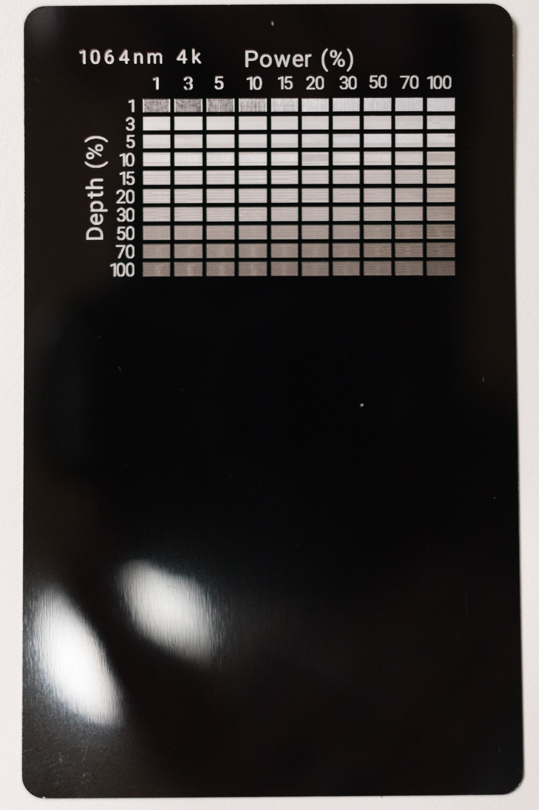

# Description
These are test charts I have created for the LaserPecker 4 using LaserPecker Design Space.

The grid should start in the top left corner and work its way towards the bottom right corner. This gives you the option to end the engraving if you get to settings too high for the material you are engraving on.

This was painstacking as I had to do it on the mobile version of the application. I also found lot of issues, such as the layer order is opposite of the engraving order.

# Notes
As of October 9th, 2023 you need to use the Android application with the experiemtnal features turned on. Go to Settings of the LaserPecker 4 -> Experimental -> Activate the Single Element Engraving parameter and Activate single-element transfer engraving.

It is best to run the text after the grid, so you can set good setting for the text to be readable. I also recommend do the text at the same resolution to get a feel for the text at that resolution.

# Approximate Times to Engrave at Original Size
| Laser Type | Resolution | Time       |
| :---       | :----      | :----      |
| 450nm      | 1k         | TBD        |
| 450nm      | 2k         | TBD        |
| 450nm      | 4k         | TBD        |
| 450nm      | 8k         | TBD        |
| 1064nm     | 1k         | TBD        |
| 1064nm     | 2k         | TBD        |
| 1064nm     | 4k         | 29 minutes |
| 1064nm     | 8k         | TBD        |

