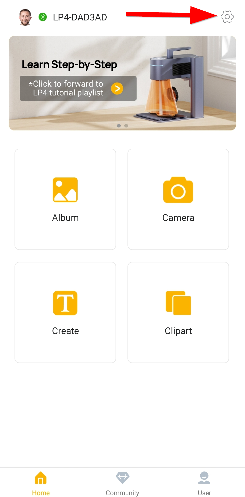
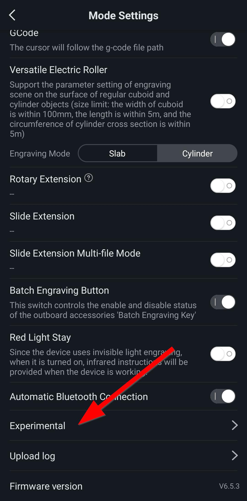
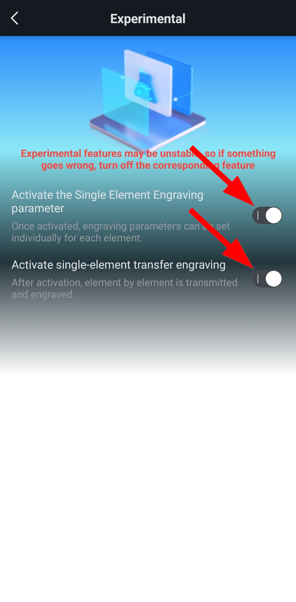

:warning: **Supervise your laser while it is engraving. Especially with flammable materials, as the grid is engraved, when higher settings are reached there is a potential fire hazard.** :warning:
# Description
These are test charts I have created for the LaserPecker 4 using LaserPecker Design Space for **Android**.

The engraving of the grid should start in the top left corner and work its way towards the bottom right corner. This gives you the option to end the engraving if you get to settings too high for the material you are engraving on.

This was painstacking as I had to do it on the mobile version of the application. I also found lot of issues, such as the layer order is opposite of the engraving order.

# Notes
As of October 11th, 2023 you need to use the Android application with the experiemtnal features *Activate the Single Element Engraving parameter* and *Activate single-element transfer engraving*.

**I suggest not moving or resizing the layers, as I have found that it causes the engaving settings to be reset on the layers.**

## Process to Engrave the Test Charts
This is the process as of October 11th 2023, because of the current state of the application(s). I am using the Android app, I am not sure if this works in the iOS app.
1. Turn on the experimental features.
    1. From the *Home* screen, click on the LaserPecker settings gear icon. 
    2. On the *Mode Settings* screen, click on the *Experimental* option. 
    3. On the *Experimental* screen, toggle on the features *Activate the Single Element Engraving parameter* and *Activate single-element transfer engraving*. 
2. Open the test chart.
3. Preview with both the Grid and Text layers visible.
4. Move your material to align it. **DON'T** move the layers in LasperPecer Design Space, as this will reset the engraving settings. **It is important to not move your material after this point, until the process is complete.**
5. Hide the Text layer.
6. Engrave the Grid.
7. Look at the engraved Grid to determin a good setting for the material you are using. Not the power and depth settings, these will be used to engrave the text.
8. Completely back out of the file.
9. Turn the experimental features off.
    1. As shown in substeps of step 1, except we are turning the toggles off.
10. Open the test chart.
11. Hide the Grid layer and show the Text layer.
12. Engrave the Text layer using the power and depth settings you noted in step 7. I recommend engraving the text with the same resolution that the test chart is for. This will give you a feel for text at that resoution.

# Time to Engrave at Original Size
This is the approximate times it took to engrave the grid at the **original size**. I am not including the time it took to engrave the text, since the time is dependant on the engraving settings you choose to run it at.
| Laser Type | Resolution | Grid Time (mm:ss) |
| :---       | :----      | :----             |
| 450nm      | 1k         | TBD               |
| 450nm      | 2k         | TBD               |
| 450nm      | 4k         | TBD               |
| 450nm      | 8k         | TBD               |
| 1064nm     | 1k         | 11:51             |
| 1064nm     | 2k         | 16:00             |
| 1064nm     | 4k         | 26:16             |
| 1064nm     | 8k         | 47:20             |

